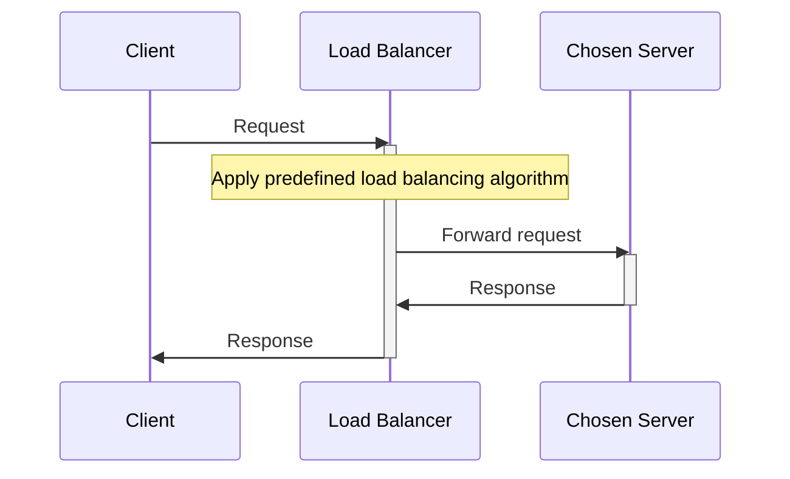
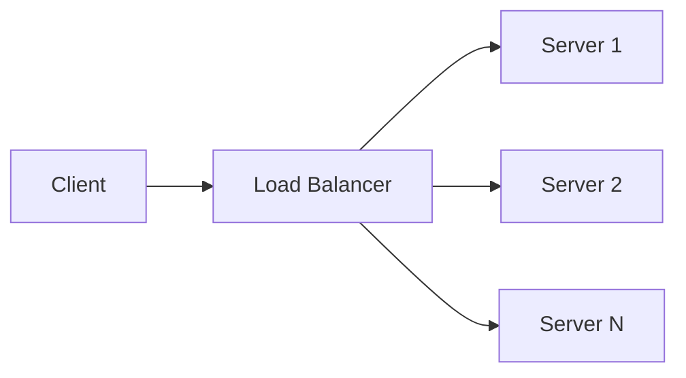
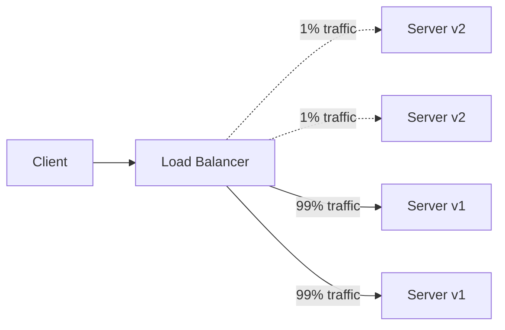

# Load Balancer

- Distribute incoming requests and traffic evenly across multiple computing resources such as servers, network links or other devices.
- High availability / reliability / performance
- Sits between client and the server (route traffic using different algorithms)
- Prevents any one server from becoming a single point of failure.

Add LBs at 3 places:
1. Between user and web server
2. Between web server and an internal platform layer
3. Between internal platform layer and db

## Key Terminology and Concepts

- **Load Balancer:** A device or software that distributes network traffic across multiple servers based on predefined rules or algorithms.
- **Backend Servers:** The servers that receive and process requests forwarded by the load balancer. Also referred to as the server pool or server farm.
- **Load Balancing Algorithm:** The method used by the load balancer to determine how to distribute incoming traffic among the backend servers.
- **Health Checks:** Periodic tests performed by the load balancer to determine the availability and performance of backend servers. Unhealthy servers are removed from the server pool until they recover.
- **Session Persistence:** A technique used to ensure that subsequent requests from the same client are directed to the same backend server, maintaining session state and providing a consistent user experience.
- **SSL/TLS Termination:** The process of decrypting SSL/TLS-encrypted traffic at the load balancer level, offloading the decryption burden from backend servers and allowing for centralized SSL/TLS management.

## Flow

## Load Balancing Algorithms

- Method used by LB to determine how to best distribute traffic
- Consider factors such as:
  1. Server capacity
  2. Active connections
  3. Response times
  4. Server health

### Round Robin

- Distributes in a cyclic order (1st server, then 2nd, after the last goes back to 1st)

#### Pros

1. Ensures an equal distribution of requests among the servers, as each server gets a turn in a fixed order.
2. Easy to implement and understand.
3. Works well when servers have similar capacities.

#### Cons

1. No Load Awareness: Does not take into account the current load or capacity of each server. All servers are treated equally regardless of their current state.
2. No Session Affinity: Subsequent requests from the same client may be directed to different servers, which can be problematic for stateful applications.
3. Performance Issues with Different Capacities: May not perform optimally when servers have different capacities or varying workloads.
4. Predictable Distribution Pattern: Round Robin is predictable in its request distribution pattern, which could potentially be exploited by attackers who can observe traffic patterns and might find vulnerabilities in specific servers by predicting which server will handle their requests.

#### Use Cases

1. Homogeneous Environments: Suitable for environments where all servers have similar capacity and performance.
2. Stateless Applications: Works well for stateless applications where each request can be handled independently.

### Least Connections

- Assigns request to the server with the fewest active connections at the time of request.

#### Pros

1. Load Awareness: Takes into account the current load on each server by considering the number of active connections, leading to better utilization of server resources.
2. Dynamic Distribution: Adapts to changing traffic patterns and server loads, ensuring no single server becomes a bottleneck.
3. Efficiency in Heterogeneous Environments: Performs well when servers have varying capacities and workloads, as it dynamically allocates requests to less busy servers.

#### Cons

1. Higher Complexity: More complex to implement compared to simpler algorithms like Round Robin, as it requires real-time monitoring of active connections.
2. State Maintenance: Requires the load balancer to maintain the state of active connections, which can increase overhead.
3. Potential for Connection Spikes: In scenarios where connection duration is short, servers can experience rapid spikes in connection counts, leading to frequent rebalancing.

#### Use Cases

1. Heterogeneous Environments: Suitable for environments where servers have different capacities and workloads, and the load needs to be dynamically distributed.
2. Variable Traffic Patterns: Works well for applications with unpredictable or highly variable traffic patterns, ensuring that no single server is overwhelmed.
3. Stateful Applications: Effective for applications where maintaining session state is important, as it helps distribute active sessions more evenly.

### Weighted Round Robin

- Assigns weights to servers based on their capacity or performance.
  (Ensures powerful servers handle a larger share of load)

#### Pros

1. Load Distribution According to Capacity: Servers with higher capacities handle more requests, leading to better utilization of resources.
2. Flexibility: Easily adjustable to accommodate changes in server capacities or additions of new servers.
3. Improved Performance: Helps in optimizing overall system performance by preventing overloading of less powerful servers.

#### Cons

1. Complexity in Weight Assignment: Determining appropriate weights for each server can be challenging and requires accurate performance metrics.
2. Increased Overhead: Managing and updating weights can introduce additional overhead, especially in dynamic environments where server performance fluctuates.
3. Not Ideal for Highly Variable Loads: In environments with highly variable load patterns, WRR may not always provide optimal load balancing as it doesn't consider real-time server load.

#### Use Cases

1. Heterogeneous Server Environments: Ideal for environments where servers have different processing capabilities, ensuring efficient use of resources.
2. Scalable Web Applications: Suitable for web applications where different servers may have varying performance characteristics.
3. Database Clusters: Useful in database clusters where some nodes have higher processing power and can handle more queries.

### Weighted Least Connections

- Takes into account both the number of active connections (`current load`) on each server and the relative capacity of each server (`weight`)

#### Pros

1. Dynamic Load Balancing: Adjusts to the real-time load on each server, ensuring a more balanced distribution of requests.
2. Capacity Awareness: Takes into account the relative capacity of each server, leading to better utilization of resources.
3. Flexibility: Can handle environments with heterogeneous servers and variable load patterns effectively.

#### Cons

1. Complexity: More complex to implement compared to simpler algorithms like Round Robin and Least Connections.
2. State Maintenance: Requires the load balancer to keep track of both active connections and server weights, increasing overhead.
3. Weight Assignment: Determining appropriate weights for each server can be challenging and requires accurate performance metrics.

#### Use Cases

1. Heterogeneous Server Environments: Ideal for environments where servers have different processing capacities and workloads.
2. High Traffic Web Applications: Suitable for web applications with variable traffic patterns, ensuring no single server becomes a bottleneck.
3. Database Clusters: Useful in database clusters where nodes have varying performance capabilities and query loads.

### IP Hash

- Assigns based on client's IP address
- IP address ----> hash function ----> hash value ----> server
- Provides session persistence

#### Pros

1. Session Persistence: Ensures that requests from the same client IP address are consistently routed to the same server, which is beneficial for stateful applications.
2. Simplicity: Easy to implement and does not require the load balancer to maintain the state of connections.
3. Deterministic: Predictable and consistent routing based on the client's IP address.

#### Cons

1. Uneven Distribution: If client IP addresses are not evenly distributed, some servers may receive more requests than others, leading to an uneven load.
2. Dynamic Changes: Adding or removing servers can disrupt the hash mapping, causing some clients to be routed to different servers.
3. Limited Flexibility: Does not take into account the current load or capacity of servers, which can lead to inefficiencies.

#### Use Cases

1. Stateful Applications: Ideal for applications where maintaining session persistence is important, such as online shopping carts or user sessions.
2. Geographically Distributed Clients: Useful when clients are distributed across different regions and consistent routing is required.

### Least Response Time

- Assigns request to server with lowest response time.
  (The server that can handle the request fastest based on recent performance metrics)
- Monitors the response time of each server
- New request gets assigned to server with lowest average response time
- Based on real-time performance data

#### Pros

1. Optimized Performance: Ensures that requests are handled by the fastest available server, leading to reduced latency and improved client experience.
2. Dynamic Load Balancing: Continuously adjusts to changing server performance, ensuring optimal distribution of load.
3. Effective Resource Utilization: Helps in better utilization of server resources by directing traffic to servers that can respond quickly.

#### Cons

1. Complexity: More complex to implement compared to simpler algorithms like Round Robin, as it requires continuous monitoring of server performance.
2. Overhead: Monitoring response times and dynamically adjusting the load can introduce additional overhead.
3. Short-Term Variability: Response times can vary in the short term due to network fluctuations or transient server issues, potentially causing frequent rebalancing.

#### Use Cases

1. Real-Time Applications: Ideal for applications where low latency and fast response times are critical, such as online gaming, video streaming, or financial trading platforms.
2. Web Services: Useful for web services and APIs that need to provide quick responses to user requests.
3. Dynamic Environments: Suitable for environments with fluctuating loads and varying server performance.

### Random

- Name speaks for itself

#### Pros

1. Simplicity: Very easy to implement and understand, requiring minimal configuration.
2. No State Maintenance: The load balancer does not need to track the state or performance of servers, reducing overhead.
3. Uniform Distribution Over Time: If the random selection is uniform, the load will be evenly distributed across servers over a long period.

#### Cons

1. No Load Awareness: Does not consider the current load or capacity of servers, which can lead to uneven distribution if server performance varies.
2. Potential for Imbalance: In the short term, random selection can lead to an uneven distribution of requests.
3. No Session Affinity: Requests from the same client may be directed to different servers, which can be problematic for stateful applications.
4. Security systems that rely on detecting anomalies (e.g., to mitigate DDoS attacks) might find it slightly more challenging to identify malicious patterns if a Random algorithm is used, due to the inherent unpredictability in request distribution. This could potentially dilute the visibility of attack patterns.

#### Use Cases

1. Homogeneous Environments: Suitable for environments where servers have similar capacity and performance.
2. Stateless Applications: Works well for stateless applications where each request can be handled independently.
3. Simple Deployments: Ideal for simple deployments where the complexity of other load balancing algorithms is not justified.

### Least Bandwidth

- Assigns requests to server that is consuming the least amount of bandwidth at the time.
  (Which server is currently transferring the least amount of data?)

#### Pros

1. Dynamic Load Balancing: Continuously adjusts to the current network load, ensuring optimal distribution of traffic.
2. Prevents Overloading: Helps in preventing any single server from being overwhelmed with too much data traffic, leading to better performance and stability.
3. Efficient Resource Utilization: Ensures that all servers are utilized more effectively by balancing the bandwidth usage.

#### Cons

1. Complexity: More complex to implement compared to simpler algorithms like Round Robin, as it requires continuous monitoring of bandwidth usage.
2. Overhead: Monitoring bandwidth and dynamically adjusting the load can introduce additional overhead.
3. Short-Term Variability: Bandwidth usage can fluctuate in the short term, potentially causing frequent rebalancing.

#### Use Cases

1. High Bandwidth Applications: Ideal for applications with high bandwidth usage, such as video streaming, file downloads, and large data transfers.
2. Content Delivery Networks (CDNs): Useful for CDNs that need to balance traffic efficiently to deliver content quickly.
3. Real-Time Applications: Suitable for real-time applications where maintaining low latency is critical.

### Custom Load

- Define your own metrics and rules for distribution
- Determine the metrics best suited for your application:
  1. CPU Usage
  2. Memory Usage
  3. Disk I/O, etc.
- Continuously monitor the defined metrics on each server
- Establish rules and algorithm that use monitored metrics to make LB decisions

#### Pros

1. Flexibility: Allows for highly customized load balancing strategies tailored to the specific needs and performance characteristics of your application.
2. Optimized Resource Utilization: Can lead to more efficient use of server resources by considering a comprehensive set of metrics.
3. Adaptability: Easily adaptable to changing conditions and requirements, making it suitable for complex and dynamic environments.

#### Cons

1. Complexity: More complex to implement and configure compared to standard load balancing algorithms.
2. Monitoring Overhead: Requires continuous monitoring of multiple metrics, which can introduce additional overhead.
3. Potential for Misconfiguration: Incorrectly defined metrics or rules can lead to suboptimal load balancing and performance issues.

#### Use Cases

1. Complex Applications: Ideal for applications with complex performance characteristics and varying resource requirements.
2. Highly Dynamic Environments: Suitable for environments where workloads and server performance can change rapidly and unpredictably.
3. Custom Requirements: Useful when standard load balancing algorithms do not meet the specific needs of the application.

### Algorithm Comparison

| Algorithm | Load Awareness | Session Persistence | Complexity | Best For |
|---|---|---|---|---|
| **Round Robin** | No | No | Low | Homogeneous environments, stateless applications |
| **Least Connections** | Yes (active connections) | No | Medium | Heterogeneous environments, variable traffic patterns |
| **Weighted Round Robin** | Partial (static weights only) | No | Medium | Heterogeneous server capacities, database clusters |
| **Weighted Least Connections** | Yes (connections + weights) | No | High | Heterogeneous servers with dynamic workloads |
| **IP Hash** | No | Yes | Low | Stateful applications requiring session stickiness |
| **Least Response Time** | Yes (response time) | No | High | Latency-sensitive, real-time applications |
| **Random** | No | No | Low | Simple deployments, stateless apps |
| **Least Bandwidth** | Yes (bandwidth usage) | No | Medium | Bandwidth-intensive apps, CDNs, video streaming |
| **Custom Load** | Yes (custom metrics) | Configurable | Very High | Complex apps with unique performance requirements |

## Uses of Load Balancing

- Optimize resource utilization
- Minimize response time
- Maximize throughput

### 1. High Availability & Fault Tolerance (The "Survival" Rule)

- If you have one server and it dies, your business is dead. If you have ten servers and one dies, but your client doesn't know which one is alive, your business is still dead.
- LB performs `Health Check` — a heartbeat monitor for your cluster.
- Constantly pings backend server with "Are you alive?"
- If it fails or returns with a 5xx code, the LB cuts off that resource instantly and reroutes the traffic.

> **Example:** Imagine you are building Uber. It's Friday night. You have 50 API servers handling ride requests. Suddenly, Server #3 suffers a catastrophic memory leak and freezes.
>
> **Without an LB:** 2% of your users (the ones unlucky enough to be routed to Server #3's IP) open the app and see a spinning wheel. They switch to Lyft. You lose revenue.
>
> **With an LB:** The load balancer sees that Server #3 failed its health check (e.g., failed to return a 200 OK on /health within 2 seconds). It immediately removes Server #3 from the active rotation. 100% of the traffic is instantly spread across the remaining 49 servers. The users never even noticed a glitch.

### 2. Horizontal Scalability (The "Black Friday" Defense)

- Vertical scaling (buying a bigger machine) hits a ceiling. Eventually, you can't buy a bigger CPU.
- You need Horizontal Scaling, which is adding more machines. But how do you tell the entire internet that you suddenly have 50 new servers? You tell the LB.
- Client only knows LB's address. LB acts as `Unified Entry Point (Virtual IP)`. So when you need to spin up more resources, you just register them with LB.

> **Example:** You are the lead engineer for an e-commerce site on Black Friday. Normal traffic is 1,000 requests per second (RPS). You have 5 servers. Suddenly, a flash sale starts. Traffic spikes to 100,000 RPS.
>
> **The Strategy:** Your Auto-Scaling Group detects high CPU usage and boots up 100 new EC2 instances.
>
> **The LB Role:** As soon as those new instances boot, they register with the Load Balancer. The LB immediately starts throwing requests at them. The massive surge of customers is diluted across the new fleet. The client (the browser) didn't have to update DNS records or know anything changed. It just worked.

### 3. Zero-Downtime Deployments (The "Blue-Green" Maneuver)

- You need to update your application. You need to update code while users are still using the site. (Can't put up an "Under Maintenance" page.)
- Load balancers allow for `Connection Draining` and strategies like `Blue-Green Deployment`.
  (Signal LB to stop sending requests to a specific server, then take it offline and apply a patch.)

> **Example:** You are deploying a new version of a Banking API.
>
> **The Process:** You have a "Blue" pool (current version) and a "Green" pool (new version).
>
> **The LB Role:** You tell the load balancer, "Send 1% of traffic to the Green pool." You monitor the logs. No errors? Good. "Send 10%." Still good? "Send 50%." "Switch to 100%."
>
> **The Save:** If you spot a critical bug at the 1% mark, you instantly tell the LB "Revert to Blue." The rollback is instant. No user downtime, no failed transactions.

### 4. Security & Attack Mitigation (The "Shield")

- Never expose your application servers directly to the internet.
- A Load Balancer acts as a `Reverse Proxy`. (Internet never touches your backend.)
- Filter out malicious traffic before reaching application logic (absorb DDoS).

> **Example:** You are running a Social Media Platform. A botnet targets your login page with a SYN Flood attack (millions of fake connection requests) to crash your database.
>
> **The Defense:** You configure your Cloud Load Balancer (like AWS ALB or Cloudflare) with WAF (Web Application Firewall) rules.
>
> **The Outcome:** The Load Balancer detects the abnormal traffic pattern. It drops those connections at the edge. Your backend servers see only valid traffic volumes and continue processing legitimate user logins. The LB took the punch so your app didn't have to.

### 5. SSL Termination (The "Offloader")

- Encryption is expensive. Handshaking SSL/TLS (decrypting HTTPS traffic) takes significant CPU power.
- Offload this task to the Load Balancer -> `SSL Termination`.
- The client speaks HTTPS to the Load Balancer. The Load Balancer decrypts it and speaks HTTP (or lighter encryption) to your backend servers inside your secure private network.

> **Example:** You are building a High-Frequency Trading Dashboard. Latency is everything.
>
> **The Bottleneck:** Your servers are hitting 90% CPU usage, but your code profiling shows that 30% of that is just OpenSSL handling encryption overhead.
>
> **The Fix:** You move your SSL certificates to the Load Balancer.
>
> **The Result:** Your backend servers no longer have to perform the heavy decryption math. Their CPU usage drops to 60%, effectively increasing your capacity by a third without buying a single new server.

## Load Balancer Types

### Hardware Load Balancing

- Physical devices (specialized hardware components such as Application-Specific Integrated Circuits (ASICs) or Field-Programmable Gate Arrays (FPGAs)) to efficiently distribute traffic.

#### Pros

1. High performance and throughput, as they are optimized for load balancing tasks.
2. Often include built-in features for network security, monitoring, and management.
3. Can handle large volumes of traffic and multiple protocols.

#### Cons

1. Can be expensive, especially for high-performance models.
2. May require specialized knowledge to configure and maintain.
3. Limited scalability, as adding capacity may require purchasing additional hardware.

> **Example:** A large e-commerce company uses a hardware load balancer to distribute incoming web traffic among multiple web servers, ensuring fast response times and a smooth shopping experience for customers.

### Software Load Balancing

- Applications (using software algorithms) that run on general purpose servers or virtual machines to distribute traffic.

#### Pros

1. Generally more affordable than hardware load balancers.
2. Can be easily scaled by adding more resources or upgrading the underlying hardware.
3. Provides flexibility, as they can be deployed on a variety of platforms and environments, including cloud-based infrastructure.

#### Cons

1. May have lower performance compared to hardware load balancers, especially under heavy loads.
2. Can consume resources on the host system, potentially affecting other applications or services.
3. May require ongoing software updates and maintenance.

> **Example:** A startup with a growing user base deploys a software load balancer on a cloud-based virtual machine, distributing incoming requests among multiple application servers to handle increased traffic.

### Cloud-based Load Balancing

- Provided as a service (offering load balancing capabilities as part of infrastructure) by cloud providers.

#### Pros

1. Highly scalable, as they can easily accommodate changes in traffic and resource demands.
2. Simplified management, as the cloud provider takes care of maintenance, updates, and security.
3. Can be more cost-effective, as users only pay for the resources they use.

#### Cons

1. Reliance on the cloud provider for performance, reliability, and security.
2. May have less control over configuration and customization compared to self-managed solutions.
3. Potential vendor lock-in, as switching to another cloud provider or platform may require significant changes.

> **Example:** A mobile app developer uses a cloud-based load balancer provided by their cloud provider to distribute incoming API requests among multiple backend servers, ensuring smooth app performance and quick response times.

### DNS Load Balancing

- Relies on DNS (Domain Name System) infrastructure to distribute incoming traffic.
- Resolves domain name to multiple IP addresses and routes the traffic based on various policies.

#### Pros

1. Relatively simple to implement, as it doesn't require specialized hardware or software.
2. Provides basic load balancing and failover capabilities.
3. Can distribute traffic across geographically distributed servers, improving performance for users in different regions.

#### Cons

1. Limited to DNS resolution time, which can be slow to update when compared to other load balancing techniques.
2. No consideration for server health, response time, or resource utilization.
3. May not be suitable for applications requiring session persistence or fine-grained load distribution.

> **Example:** A content delivery network (CDN) uses DNS load balancing to direct users to the closest edge server based on their geographical location, ensuring faster content delivery and reduced latency.

### Global Server Load Balancing

- DNS load balancing + health checks + advanced features to distribute traffic across geographically dispersed data centers.

#### Pros

1. Provides load balancing and failover capabilities across multiple data centers or geographic locations.
2. Can improve performance and reduce latency for users by directing them to the closest or best-performing data center.
3. Supports advanced features, such as server health checks, session persistence, and custom routing policies.

#### Cons

1. Can be more complex to set up and manage than other load balancing techniques.
2. May require specialized hardware or software, increasing costs.
3. Can be subject to the limitations of DNS, such as slow updates and caching issues.

> **Example:** A multinational corporation uses GSLB to distribute incoming requests for its web applications among several data centers around the world, ensuring high availability and optimal performance for users in different regions.

### Hybrid Load Balancing

- Combines features & capabilities of multiple LB techniques.
- Mix of hardware, software and cloud-based solutions.

#### Pros

1. Offers a high degree of flexibility, as it can be tailored to specific requirements and infrastructure.
2. Can provide the best combination of performance, scalability, and reliability by leveraging the strengths of different load balancing techniques.
3. Allows organizations to adapt and evolve their load balancing strategy as their needs change over time.

#### Cons

1. Can be more complex to set up, configure, and manage than single-technique solutions.
2. May require a higher level of expertise and understanding of multiple load balancing techniques.
3. Potentially higher costs, as it may involve a combination of hardware, software, and cloud-based services.

> **Example:** A large-scale online streaming platform uses a hybrid load balancing strategy, combining hardware load balancers in their data centers for high-performance traffic distribution, cloud-based load balancers for scalable content delivery, and DNS load balancing for global traffic management. This approach ensures optimal performance, scalability, and reliability for their millions of users worldwide.

### Layer 4 Load Balancing

- Transport layer load balancing.
- Operates at the transport layer (4th layer) of OSI model.
- Distributes based on info from TCP/UDP header:
  - Source/destination IP
  - Port numbers

#### Pros

1. Fast and efficient, as it makes decisions based on limited information from the transport layer.
2. Can handle a wide variety of protocols and traffic types.
3. Relatively simple to implement and manage.

#### Cons

1. Lacks awareness of application-level information, which may limit its effectiveness in some scenarios.
2. No consideration for server health, response time, or resource utilization.
3. May not be suitable for applications requiring session persistence or fine-grained load distribution.

> **Example:** An online gaming platform uses Layer 4 load balancing to distribute game server traffic based on IP addresses and port numbers, ensuring that players are evenly distributed among available game servers for smooth gameplay.

### Layer 7 Load Balancing

- Application layer load balancing.
- Operates at the application layer (7th layer) of OSI model.
- Distributes based on application-specific info:
  - HTTP headers
  - Cookies
  - URL paths

#### Pros

1. Provides more intelligent and fine-grained load balancing, as it considers application-level information.
2. Can support advanced features, such as session persistence, content-based routing, and SSL offloading.
3. Can be tailored to specific application requirements and protocols.

#### Cons

1. Can be slower and more resource-intensive compared to Layer 4 load balancing, as it requires deeper inspection of incoming traffic.
2. May require specialized software or hardware to handle application-level traffic inspection and processing.
3. Potentially more complex to set up and manage compared to other load balancing techniques.

> **Example:** A web application with multiple microservices uses Layer 7 load balancing to route incoming API requests based on the URL path, ensuring that each microservice receives only the requests it is responsible for handling.

## Stateless Vs Stateful Load Balancing

### Stateless Load Balancing

- Do not maintain any info about clients' session or connection state.
- Decision making solely on incoming request data.
- Since they do not store session info: can quickly and efficiently distribute traffic.

> **Example:** Consider a web application that enables users to search for products according to their location. A stateless load balancer can allocate requests to servers based on the user's geographic location, without retaining any session data.

### Stateful Load Balancing

- Preserves session info between requests.
- LB assigns a client to a specific server, and ensures all subsequent requests from the same client are directed to that server.

> **Example:** Suppose a web application that requires users to log in to access their personal information. A stateful load balancer can guarantee that requests from the same user are routed to the same server, allowing session data such as login credentials to be available.

- Further categorized into 2 types:
  1. **Source IP affinity:** Assigns to a specific server based on client's IP address. May pose issues if client's IP changes frequently (mobile networks).
  2. **Session affinity:** Assigns to a specific server based on a session identifier (cookie / URL param).

## High Availability and Fault Tolerance

### Redundancy and failover strategies for load balancers

- Having multiple instances of LB that can take over if one fails.
- Redundancy can be achieved through below failover strategies:
  1. **Active-passive configuration:**
     - Active instance of LB handles all incoming traffic and passive instance remains on standby.
     - If active LB fails, passive instance takes over.
  2. **Active-active configuration:**
     - Multiple LB instances actively process incoming traffic simultaneously.
     - Between LB instances, traffic is distributed based on methods like DNS load balancing or additional LB.

### Health checks and monitoring

- By monitoring health of backend servers, LB can automatically remove unhealthy servers from the server pool and avoid sending traffic to them.
- Monitoring the load balancer itself is also crucial. By keeping track of performance metrics, such as response times, error rates, and resource utilization, we can detect potential issues and take corrective action before they lead to failures or service degradation.
- Essential to have proper alerting and incident response procedure.

### Synchronization and State Sharing

- During multiple instances of LB, it is crucial that LB instances maintain a constant view of the system's state.
  1. **Centralized configuration management:**
     - Centralized config store (like etcd, Consul, Zookeeper) to maintain and distribute config data among LB instances.
  2. **State sharing and replication:**
     - Where LB must maintain session data / other state info. Can be achieved through database replication, distributed caching system (Redis) or built-in state sharing mechanisms.

## Scalability and Performance

### Horizontal and vertical scaling of load balancers

- Ensure LB can handle traffic as traffic increases:
  1. **Horizontal scaling:** (preferred for large-scale applications)
     - Adding more LB instances.
     - Particularly effective for active-active configurations.
  2. **Vertical scaling:**
     - Increasing the resources (CPU, memory, network capacity) of existing LB instances.
     - Often limited by maximum capacity of single instance.

### Connection and request rate limits

- Implementing rate limiting and connection limits at the load balancer level can help prevent overloading and ensure consistent performance.
- Enforce rate limits based on various criteria:
  - IP addresses
  - Client domains
  - URL patterns
- Can help mitigate the impact of Denial of Service (DoS) attacks and prevent a single client from monopolizing resources.

### Caching and content optimization

- Can cache static content (images, CSS, JavaScript files) to reduce load on backend servers & improve response time.
- Some LB also support content optimization features like compression or minification (can reduce bandwidth consumption).

### Impact of load balancers on latency

- Adds an additional network hop -> increased latency (impact is minimal but it is there).
- Optimizing the performance of the load balancer can be achieved through various strategies, including:

  **Geographical distribution:** Deploying load balancers and backend servers in geographically distributed locations can help reduce latency for users by ensuring that their requests are processed by a nearby instance.

  **Connection reuse:** Many load balancers support connection reuse or keep-alive connections, which reduce the overhead of establishing new connections between the load balancer and backend servers for each request.

  **Protocol optimizations:** Some load balancers support protocol optimizations, such as HTTP/2 or QUIC, which can improve performance by reducing latency and increasing throughput.

## Challenges of Load Balancer

1. **Single point of failure**
   Remedy: Implement high availability and failover mechanisms, such as redundant load balancer instances, to ensure continuity even if one instance fails.

2. **Configuration Complexity**
   Remedy: Regularly review and update configurations, and consider using automated configuration tools or expert consultation to ensure optimal settings.

3. **Scalability Limitations**
   Remedy: Plan for horizontal or vertical scaling of the load balancer to match traffic demands, and use scalable cloud-based load balancing solutions.

4. **Latency**
   Remedy: Optimize load balancer performance through efficient routing algorithms and by placing the load balancer geographically close to the majority of users.

5. **Sticky Sessions (Session persistence)**
   Remedy: Employ advanced load balancing techniques that balance the need for session persistence with even traffic distribution, or redesign the application to reduce dependence on session state.

6. **Cost**
   Remedy: Opt for cost-effective load balancing solutions, such as open-source software or cloud-based services that offer pay-as-you-go pricing models.

7. **Health checks and monitoring**
   Remedy: Implement comprehensive and regular health checks for backend servers, and use real-time monitoring tools to ensure traffic is always directed to healthy instances.

## Miscellaneous / Additional Concepts
