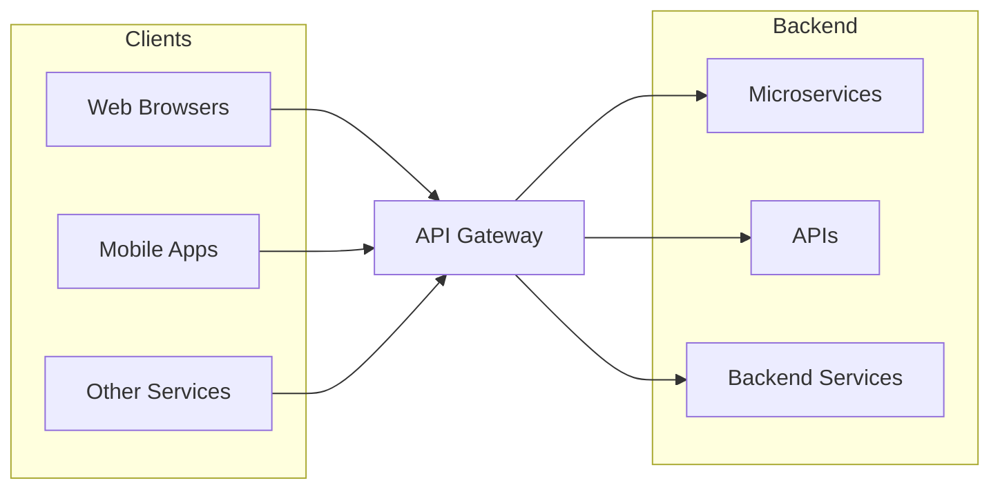

# API Gateway

- Server-side architectural component that acts as intermediary.

- Provides a single entry point for external consumers.
- Receives client requests.
- Forwards them to the appropriate microservice.
- Returns server's response to the client.

**Responsibilities:**
- Routing
- Authentication
- Rate limiting

## Difference between an API Gateway and a Load Balancer

- An API gateway is focused on *routing* requests to the appropriate microservice, while a load balancer is focused on *distributing* requests evenly across a group of backend servers.
- An API gateway is typically used to handle requests for APIs. These requests typically have a specific URL that identifies the API that the client is trying to access, and the API gateway routes the request to the appropriate microservice based on this URL. A load balancer, on the other hand, is typically used to handle requests that are sent to a single, well-known IP address, and then routes them to one of many possible backend servers based on factors such as server performance and availability.

## Key Usages of API Gateways

- In microservice architecture, there are many small independent services that handle specific tasks, so this simplifies communication between numerous services and clients by providing a single entry point for all client requests.
1. Request Routing
Usage: Directing incoming client requests to the appropriate backend service.

Example: Suppose you have an e-commerce application with separate services for user management, product catalog, and order processing. When a client requests product details, the API Gateway routes this request to the product catalog service. If the client wants to place an order, the gateway directs the request to the order processing service.

2. Aggregation of Multiple Services
Usage: Combining responses from multiple backend services into a single response to the client.

Example: A mobile app needs to display user profile information along with recent orders and recommendations. Instead of the client making separate requests to each service, the API Gateway can fetch data from the user service, order service, and recommendation service, then compile and send a unified response to the client.

3. Security Enforcement
Usage: Implementing security measures such as authentication, authorization, and rate limiting.

Example: Before a request reaches any backend service, the API Gateway can verify the user's authentication token to ensure they are logged in. It can also check if the user has the necessary permissions to access certain data and limit the number of requests from a single user to prevent abuse.

4. Load Balancing
Usage: Distributing incoming requests evenly across multiple instances of backend services to ensure no single service becomes a bottleneck.

Example: If your application experiences high traffic, the API Gateway can distribute incoming requests for the product catalog service across several server instances, ensuring efficient use of resources and maintaining performance.

5. Caching Responses
Usage: Storing frequently requested data to reduce latency and decrease the load on backend services.

Example: If the product catalog doesn't change frequently, the API Gateway can cache product information. When a client requests product details, the gateway can serve the cached data instead of querying the product catalog service every time, resulting in faster response times.

6. Protocol Translation
Usage: Converting requests and responses between different protocols used by clients and backend services.

Example: A client might send requests over HTTP/HTTPS, while some backend services communicate using WebSockets or gRPC. The API Gateway can handle the necessary protocol conversions, allowing seamless communication between clients and services.

7. Monitoring and Logging
Usage: Tracking and recording request and response data for analysis, debugging, and performance monitoring.

Example: The API Gateway can log all incoming requests, including details like request paths, response times, and error rates. This information is invaluable for identifying performance issues, understanding usage patterns, and troubleshooting problems.

8. Transformation of Requests and Responses
Usage: Modifying the data format or structure of requests and responses to meet the needs of clients or services.

Example: Suppose a client expects data in JSON format, but a backend service provides data in XML. The API Gateway can transform the XML response into JSON before sending it to the client, ensuring compatibility without requiring changes to the backend service.

9. API Versioning
Usage: Managing different versions of APIs to ensure backward compatibility and smooth transitions when updates are made.

Example: Imagine you have a mobile app that relies on your backend services. When you update the API to add new features or make changes, older versions of the app might still need to interact with the previous API version. The API Gateway can route requests to different backend service versions based on the API version specified in the request, ensuring that both old and new clients operate seamlessly without disruption.

10. Rate Limiting and Throttling
Usage: Controlling the number of requests a client can make in a given time frame to protect backend services from being overwhelmed.

Example: Suppose your API is publicly accessible and you want to prevent any single user from making too many requests in a short period, which could degrade performance for others. The API Gateway can enforce rate limits, such as allowing a maximum of 100 requests per minute per user. If a user exceeds this limit, the gateway can temporarily block further requests, ensuring fair usage and maintaining service stability.

11. API Monetization
Usage: Enabling businesses to monetize their APIs by controlling access, usage tiers, and billing.

Example: A company provides a public API for accessing weather data. Using an API Gateway, they can create different subscription tiers (e.g., free, basic, premium) with varying levels of access and usage limits. The gateway can handle authentication, track usage based on subscription plans, and integrate with billing systems to charge users accordingly. This setup allows the company to generate revenue from their API offerings effectively.

12. Service Discovery Integration
Usage: Facilitating dynamic discovery of backend services, especially in environments where services are frequently scaled up or down.

Example: In a microservices environment using Kubernetes, services can scale dynamically based on demand. The API Gateway can integrate with a service discovery tool (like Consul or Eureka) to automatically route requests to the appropriate service instances, even as they change. This ensures that clients always connect to available and healthy service instances without manual configuration.

13. Circuit Breaker Pattern Implementation
Usage: Preventing cascading failures by detecting when a backend service is failing and stopping requests to it temporarily.

Example: If your order processing service is experiencing issues and becomes unresponsive, the API Gateway can detect the failure pattern and activate a circuit breaker. This means the gateway will stop sending new requests to the problematic service for a specified period, allowing it time to recover. During this time, the gateway can return fallback responses to clients, maintaining overall system stability.

14. Content-Based Routing
Usage: Routing requests to different backend services based on the content of the request, such as headers, body, or query parameters.

Example: Consider an API that handles different types of media uploads (images, videos, documents). The API Gateway can inspect the Content-Type header of incoming requests and route them to specialized backend services optimized for handling each media type. This ensures that each type of content is processed efficiently by the appropriate service.

15. SSL Termination
Usage: Handling SSL/TLS encryption and decryption at the gateway level to offload this resource-intensive task from backend services.

Example: Instead of each backend service managing its own SSL certificates and handling encryption, the API Gateway can terminate SSL connections. Clients communicate securely with the gateway over HTTPS, and the gateway forwards requests to backend services over HTTP or a secure internal network. This simplifies certificate management and reduces the computational load on backend services.

16. Policy Enforcement
Usage: Applying organizational policies consistently across all API traffic, such as data validation, request formatting, and access controls.

Example: Your organization might have policies requiring that all incoming data be validated for specific fields or that certain headers are present in requests. The API Gateway can enforce these policies by validating incoming requests before they reach backend services. If a request doesn't comply, the gateway can reject it with an appropriate error message, ensuring that only well-formed and authorized requests are processed.

17. Multi-Tenancy Support
Usage: Supporting multiple clients or tenants within a single API infrastructure while ensuring data isolation and customized configurations.

Example: A SaaS platform serves multiple businesses, each considered a tenant. The API Gateway can distinguish between tenants based on headers or authentication tokens and route requests to tenant-specific services or databases. It can also apply tenant-specific rate limits, logging, and security policies, ensuring that each tenant operates in a secure and isolated environment.

18. A/B Testing and Canary Releases
Usage: Facilitating controlled testing of new features or services by directing a subset of traffic to different backend versions.

Example: When deploying a new version of the user recommendation service, you might want to test its performance and impact on user experience without affecting all users. The API Gateway can route a small percentage of requests to the new version (canary release) while the majority continue using the stable version. This approach allows you to monitor the new service's behavior and roll it out more broadly once it's proven reliable.

19. Localization and Internationalization Support
Usage: Adapting responses based on the client's locale, such as language preferences or regional settings.

Example: If your application serves users in different countries, the API Gateway can detect the user's locale from request headers or parameters and modify responses accordingly. For instance, it can format dates, numbers, or currencies to match the user's regional standards or serve localized content by fetching data from region-specific backend services.

20. Reducing Client Complexity
Usage: Simplifying the client-side logic by handling complex operations on the server side through the gateway.

Example: A client application might need to perform multiple operations to complete a user registration process, such as creating a user account, sending a welcome email, and logging the registration event. Instead of the client making separate API calls for each operation, the API Gateway can expose a single endpoint that orchestrates these actions behind the scenes. This reduces the complexity of the client code and minimizes the number of network requests.

## Advantages and Disadvantages

### Advantages

1. **Single Entry Point:** Provides a unified access point for all client requests, simplifying client-side code and reducing complexity.
2. **Centralized Cross-Cutting Concerns:** Authentication, authorization, rate limiting, logging, and monitoring can be handled in one place rather than duplicated across every microservice.
3. **Request Routing & Composition:** Can route requests to the appropriate microservice, aggregate responses from multiple services, and transform protocols (e.g., HTTP to gRPC).
4. **Protocol Translation:** Translates between different communication protocols (e.g., REST, WebSocket, gRPC) so clients and backend services don't need to agree on a single protocol.
5. **Security & Attack Mitigation:** Acts as a first line of defense by filtering malicious traffic, enforcing authentication, and protecting backend services from direct exposure.
6. **Simplified Client Communication:** Reduces the number of endpoints clients need to be aware of, making it easier to evolve backend services without impacting clients.
7. **Caching & Response Transformation:** Can cache frequently requested responses and transform request/response payloads as needed.

### Disadvantages

1. **Single Point of Failure:** If the API gateway goes down, all client requests are blocked. Requires high availability setup and redundancy.
2. **Added Latency:** Every request passes through the gateway, adding an extra network hop and potential processing delay.
3. **Increased Complexity:** The gateway becomes a critical component that needs careful configuration, deployment, and monitoring.
4. **Potential Bottleneck:** At high traffic volumes, the gateway can become a performance bottleneck if not properly scaled.
5. **Coupling Risk:** Backend services become coupled to the gateway's routing rules and configuration, making changes more impactful.
6. **Development Overhead:** Building and maintaining a custom API gateway requires significant engineering effort.
