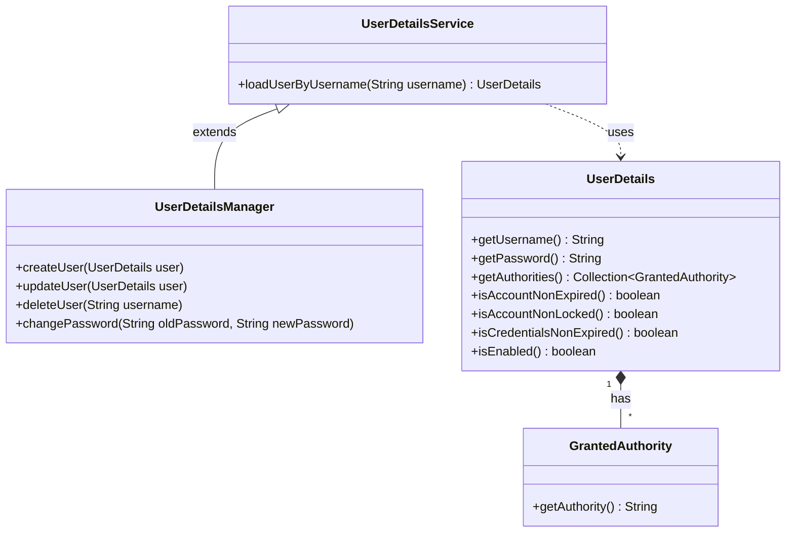

## Understanding Users in Spring Security

### Recap: The Hogwarts Analogy

In Chapter 1, we learned how Harry enters Hogwarts:
- **Hagrid** collects student names
- **McGonagall** decides who checks them
- **Sorting Hat** actually verifies them
- **Registry Book** stores student information
- **House Badge** proves identity throughout the castle

Now we dive deep into **how Hogwarts defines, stores, and manages wizards** — or in our world: **how Spring Security handles users**.

---

## Class Relationships Overview

Before we explore each component, here is how they connect to each other:



**Key Points:**
- `UserDetailsService` **uses** `UserDetails` (dashed arrow = dependency)
- `UserDetailsManager` **extends** `UserDetailsService` (solid arrow = inheritance)
- `UserDetails` **has** one or more `GrantedAuthority` (diamond = composition, 1 to *)

---

## 1. The Foundation: Defining the Wizard

Before Hogwarts can sort a student, they need to know **what information makes a wizard**. A wizard is not just a name — they have:

- A **true name** (username)
- A **password** to prove identity
- **Roles** (what they can do: attend classes, enter common rooms)
- **Status** (is their account active, expired, locked?)

Spring Security uses two key interfaces to define a user:

### `UserDetails` — The Wizard Profile

This interface tells Spring Security: *"Here is what a user looks like in my application."*

```java
public interface UserDetails {
    String getUsername();              // The wizard's true name
    String getPassword();              // Their secret password
    
    // What the wizard is allowed to do (roles/permissions)
    Collection<? extends GrantedAuthority> getAuthorities();
    
    // Account status checks
    boolean isAccountNonExpired();     // Is their enrollment still valid?
    boolean isAccountNonLocked();      // Are they banned?
    boolean isCredentialsNonExpired(); // Is their password still fresh?
    boolean isEnabled();               // Are they allowed to enter?
}
```

**Think of it like a student card at Hogwarts:**

| Field | Hogwarts Equivalent | Example |
|-------|---------------------|---------|
| `username` | Student's full name | "Harry Potter" |
| `password` | Secret spoken password | "Mischief Managed" |
| `authorities` | House + Permissions | "Gryffindor, Can use library, Can play Quidditch" |
| `isEnabled` | Is the student expelled? | `true` = still enrolled |

:::tip Simple Rule
If you want Spring Security to recognize your users, you must give it a `UserDetails` object.
:::

---

### `GrantedAuthority` — What the Wizard Can Do

This interface defines **permissions** or **roles**.

```java
public interface GrantedAuthority {
    String getAuthority();  // Returns the permission name
}
```

**Examples of authorities at Hogwarts:**
- `"Gryffindor"` — Which house they belong to
- `"ROLE_STUDENT"` — Basic student rights
- `"ENTER_LIBRARY"` — Can access the library
- `"PLAY_QUIDDITCH"` — Can join the Quidditch team
- `"USE_MAGIC"` — Allowed to cast spells

```java
// Creating authorities
SimpleGrantedAuthority gryffindor = new SimpleGrantedAuthority("Gryffindor");
SimpleGrantedAuthority libraryAccess = new SimpleGrantedAuthority("ENTER_LIBRARY");

// A student might have multiple authorities
List<GrantedAuthority> harrysPowers = Arrays.asList(
    new SimpleGrantedAuthority("Gryffindor"),
    new SimpleGrantedAuthority("ROLE_STUDENT"),
    new SimpleGrantedAuthority("PLAY_QUIDDITCH")
);
```

:::note Why This Matters
Just like house badges show what areas of Hogwarts you can enter, `GrantedAuthority` tells Spring Security what parts of your application a user can access.
:::

---

### Putting It Together: Creating a Wizard

Spring provides a built-in implementation: `org.springframework.security.core.userdetails.User`

```java
// Creating Harry Potter as a UserDetails object
UserDetails harry = User.builder()
    .username("harry.potter")
    .password("{bcrypt}$2a$10$...")  // Encoded password
    .roles("STUDENT")                 // Shortcut for ROLE_STUDENT
    .authorities("Gryffindor", "PLAY_QUIDDITCH", "ENTER_LIBRARY")
    .accountExpired(false)
    .accountLocked(false)
    .credentialsExpired(false)
    .disabled(false)
    .build();
```

**Or using the constructor:**

```java
UserDetails harry = new User(
    "harry.potter",                          // username
    "$2a$10$...",                            // encoded password
    true,                                    // enabled
    true,                                    // accountNonExpired
    true,                                    // credentialsNonExpired
    true,                                    // accountNonLocked
    Arrays.asList(                           // authorities
        new SimpleGrantedAuthority("Gryffindor"),
        new SimpleGrantedAuthority("ROLE_STUDENT"),
        new SimpleGrantedAuthority("PLAY_QUIDDITCH")
    )
);
```

---

## 2. The Retrieval Contract: Finding the Wizard

Now that we know what a wizard looks like, how do we **find one** when they arrive at the castle gates?

### `UserDetailsService` — The Registry Book

Remember the **Hogwarts Registry Book** in Dumbledore's office? It contains every wizard's information, but it only **reads** — it doesn't judge or sort.

That's exactly what `UserDetailsService` does.

```java
public interface UserDetailsService {
    
    // The ONLY method: Find a user by their username
    UserDetails loadUserByUsername(String username) 
        throws UsernameNotFoundException;
}
```

**Key Points:**
- **Single responsibility**: Only finds users. Does NOT check passwords.
- **Returns UserDetails**: The wizard profile we defined earlier.
- **Throws exception**: If the name is not in the book, throws `UsernameNotFoundException`.

:::warning Critical Rule
`UserDetailsService` **never** checks if the password is correct. It only answers: *"Does this person exist in our records?"*
:::

---

### Creating Your Own Registry Book

In real applications, you create your own `UserDetailsService` that talks to your database:

```java
@Service
public class WizardRegistryService implements UserDetailsService {
    
    @Autowired
    private WizardRepository wizardRepository;  // Your JPA repository
    
    @Override
    public UserDetails loadUserByUsername(String username) {
        
        // Step 1: Look in the database
        Wizard wizard = wizardRepository.findByUsername(username)
            .orElseThrow(() -> new UsernameNotFoundException(
                "Wizard not found: " + username
            ));
        
        // Step 2: Convert to UserDetails
        return new org.springframework.security.core.userdetails.User(
            wizard.getUsername(),
            wizard.getPassword(),      // This is already encoded!
            wizard.getAuthorities()    // Roles/permissions from DB
        );
    }
}
```

**The Flow:**
```
Sorting Hat needs to check Harry
      ↓
Calls UserDetailsService.loadUserByUsername("harry.potter")
      ↓
Registry Book looks up "harry.potter" in database
      ↓
Returns Harry's profile (name, encoded password, house, permissions)
      ↓
Sorting Hat now has the profile to check against the spoken password
```

---

### Connection to PasswordEncoder

After `UserDetailsService` returns the wizard's profile:

1. The `AuthenticationProvider` (Sorting Hat) receives the profile
2. It extracts the **stored encoded password** from the profile
3. It uses `PasswordEncoder` to compare with the **password Harry spoke**
4. If they match → Harry is authenticated!

```java
// Inside DaoAuthenticationProvider (the Sorting Hat)
public Authentication authenticate(Authentication authentication) {
    
    String username = authentication.getName();
    String providedPassword = authentication.getCredentials().toString();
    
    // Step 1: Ask the Registry Book for the wizard
    UserDetails user = userDetailsService.loadUserByUsername(username);
    
    // Step 2: Use Magic Glass (PasswordEncoder) to check password
    if (!passwordEncoder.matches(providedPassword, user.getPassword())) {
        throw new BadCredentialsException("Wrong password!");
    }
    
    // Step 3: Success! Create the authenticated token
    return new UsernamePasswordAuthenticationToken(
        user,                    // Principal (the wizard)
        null,                    // Credentials erased
        user.getAuthorities()    // Their powers
    );
}
```

---

## 3. The Manager: Beyond Just Reading

`UserDetailsService` only **reads** from the Registry Book. But what if you need to:
- Add a **new student**?
- **Update** a student's password?
- **Delete** an expelled student?
- **Lock** a misbehaving student's account?

Enter **`UserDetailsManager`** — The **Administrator of the Registry Book**.

### `UserDetailsManager` — The Book Keeper

```java
public interface UserDetailsManager extends UserDetailsService {
    
    // Create a new user
    void createUser(UserDetails user);
    
    // Update existing user
    void updateUser(UserDetails user);
    
    // Remove a user
    void deleteUser(String username);
    
    // Change password
    void changePassword(String oldPassword, String newPassword);
    
    // Check if user exists
    boolean userExists(String username);
}
```

**The Difference:**

| Feature | `UserDetailsService` (Reader) | `UserDetailsManager` (Administrator) |
|---------|------------------------------|-------------------------------------|
| Can read users? | ✅ Yes | ✅ Yes (inherits from Service) |
| Can create users? | ❌ No | ✅ Yes |
| Can update users? | ❌ No | ✅ Yes |
| Can delete users? | ❌ No | ✅ Yes |
| Can change passwords? | ❌ No | ✅ Yes |
| Use case | Login, authentication | User admin panels, registration |

:::note When to Use Which
- **Use `UserDetailsService`** when you only need to **verify** users during login.
- **Use `UserDetailsManager`** when you need a full **user management system** (admin dashboards, user registration, etc.).
:::

---

### Example: A Custom Manager

```java
@Service
public class HogwartsUserManager implements UserDetailsManager {
    
    @Autowired
    private WizardRepository wizardRepository;
    
    @Autowired
    private PasswordEncoder passwordEncoder;
    
    @Override
    public void createUser(UserDetails user) {
        // Check if wizard already exists
        if (userExists(user.getUsername())) {
            throw new IllegalArgumentException("Wizard already exists!");
        }
        
        // Create new wizard record
        Wizard wizard = new Wizard();
        wizard.setUsername(user.getUsername());
        wizard.setPassword(user.getPassword());  // Already encoded
        wizard.setAuthorities(user.getAuthorities());
        wizard.setEnabled(user.isEnabled());
        
        wizardRepository.save(wizard);
    }
    
    @Override
    public void changePassword(String oldPassword, String newPassword) {
        // Get current user
        String username = SecurityContextHolder.getContext()
            .getAuthentication().getName();
        
        Wizard wizard = wizardRepository.findByUsername(username)
            .orElseThrow(() -> new UsernameNotFoundException("Wizard not found"));
        
        // Verify old password
        if (!passwordEncoder.matches(oldPassword, wizard.getPassword())) {
            throw new BadCredentialsException("Old password is wrong!");
        }
        
        // Update to new encoded password
        wizard.setPassword(passwordEncoder.encode(newPassword));
        wizardRepository.save(wizard);
    }
    
    @Override
    public UserDetails loadUserByUsername(String username) {
        // Same as before...
    }
    
    // ... other methods
}
```

---

## 4. Implementation Strategies: Built-in vs Custom

Spring Security gives you **ready-made Registry Books**, or you can write your own.

### Built-in Implementations

| Implementation | What It Does | Best For |
|----------------|--------------|----------|
| **InMemoryUserDetailsManager** | Stores users in memory (RAM) | Testing, demos, small apps |
| **JdbcUserDetailsManager** | Stores users in SQL database | Traditional applications with JDBC |
| **LdapUserDetailsManager** | Connects to LDAP server | Enterprise with Active Directory |

---

#### InMemoryUserDetailsManager (For Testing)

Perfect for learning or testing when you don't have a database yet.

```java
@Bean
public UserDetailsService userDetailsService() {
    
    // Create the manager
    InMemoryUserDetailsManager manager = new InMemoryUserDetailsManager();
    
    // Create Harry
    UserDetails harry = User.builder()
        .username("harry.potter")
        .password(passwordEncoder().encode("mischief"))
        .roles("STUDENT")
        .authorities("Gryffindor", "PLAY_QUIDDITCH")
        .build();
    
    // Create Hermione
    UserDetails hermione = User.builder()
        .username("hermione.granger")
        .password(passwordEncoder().encode("books"))
        .roles("STUDENT")
        .authorities("Gryffindor", "ENTER_LIBRARY")
        .build();
    
    // Create Snape (admin)
    UserDetails snape = User.builder()
        .username("severus.snape")
        .password(passwordEncoder().encode("lily"))
        .roles("TEACHER", "ADMIN")
        .authorities("Slytherin", "BREW_POTIONS", "MANAGE_POINTS")
        .build();
    
    // Add to the manager
    manager.createUser(harry);
    manager.createUser(hermione);
    manager.createUser(snape);
    
    return manager;
}
```

:::danger Memory Limitation
All users disappear when the app restarts! **Never use this in production.**
:::

---

#### JdbcUserDetailsManager (For SQL Databases)

If you have a relational database (MySQL, PostgreSQL, etc.), use this.

**Required Database Schema:**

```sql
-- Users table
CREATE TABLE users (
    username VARCHAR(50) NOT NULL PRIMARY KEY,
    password VARCHAR(500) NOT NULL,
    enabled BOOLEAN NOT NULL DEFAULT TRUE
);

-- Authorities (permissions) table
CREATE TABLE authorities (
    username VARCHAR(50) NOT NULL,
    authority VARCHAR(50) NOT NULL,
    CONSTRAINT fk_authorities_users 
        FOREIGN KEY(username) REFERENCES users(username)
);

CREATE UNIQUE INDEX ix_auth_username 
    ON authorities(username, authority);
```

**Spring Configuration:**

```java
@Configuration
public class SecurityConfig {
    
    @Autowired
    private DataSource dataSource;  // Your database connection
    
    @Bean
    public UserDetailsManager userDetailsManager() {
        JdbcUserDetailsManager manager = new JdbcUserDetailsManager(dataSource);
        
        // Optional: Customize queries if your table names are different
        manager.setUsersByUsernameQuery(
            "SELECT username, password, enabled FROM wizards WHERE username = ?"
        );
        manager.setAuthoritiesByUsernameQuery(
            "SELECT username, authority FROM wizard_powers WHERE username = ?"
        );
        
        return manager;
    }
}
```

---

### When to Write Custom Implementation

Build your own `UserDetailsService` or `UserDetailsManager` when:

| Scenario | Why Custom? |
|----------|-------------|
| **NoSQL Database** (MongoDB, Redis) | Built-in managers only work with SQL |
| **Microservices** | Fetch users from another service via REST API |
| **Complex Legacy Systems** | Your user data is spread across multiple tables |
| **Extra User Info** | You need to load additional fields (email, phone, profile picture) |
| **Caching** | You want to cache users in Redis for speed |

**Example: Loading from a Microservice**

```java
@Service
public class UserServiceClient implements UserDetailsService {
    
    @Autowired
    private RestTemplate restTemplate;
    
    @Override
    public UserDetails loadUserByUsername(String username) {
        
        // Call another microservice to get user data
        ResponseEntity<UserDto> response = restTemplate.getForEntity(
            "http://user-service/api/users/{username}",
            UserDto.class,
            username
        );
        
        UserDto user = response.getBody();
        
        if (user == null) {
            throw new UsernameNotFoundException("User not found");
        }
        
        return new org.springframework.security.core.userdetails.User(
            user.getUsername(),
            user.getPassword(),
            mapRolesToAuthorities(user.getRoles())
        );
    }
}
```

---

## 5. Best Practices & Real-World Application

### Which Implementation to Choose?

| Situation | Recommended Approach |
|-----------|---------------------|
| Learning / Demo | `InMemoryUserDetailsManager` |
| Small App with SQL | `JdbcUserDetailsManager` with default schema |
| Spring Boot + JPA | **Custom** `UserDetailsService` with your `@Entity` |
| Microservices Architecture | **Custom** service calling user-service |
| Enterprise with AD/LDAP | `LdapUserDetailsManager` |
| High Traffic | **Custom** with Redis caching layer |

---

### Security Considerations

:::danger NEVER Store Plain Text Passwords
Always encode passwords before saving:

```java
// WRONG ❌
user.setPassword("rawPassword");

// RIGHT ✅
user.setPassword(passwordEncoder.encode("rawPassword"));
```
:::

:::tip Use DelegatingPasswordEncoder for Migrations
If you're changing password algorithms, use this to support both old and new:

```java
@Bean
public PasswordEncoder passwordEncoder() {
    return PasswordEncoderFactories.createDelegatingPasswordEncoder();
}

// Now you can have passwords prefixed with their algorithm:
// {bcrypt}$2a$10$...   (new)
// {sha256}5e884898da... (old, will be upgraded on next login)
```
:::

:::warning Return Encoded Password from UserDetailsService
Your `UserDetailsService` must return **already-encoded** passwords from the database. Never encode them during `loadUserByUsername()`.
:::

---

### Real-World Production Example

```java
@Service
public class ProductionUserService implements UserDetailsManager {
    
    @Autowired
    private UserRepository userRepository;
    
    @Autowired
    private PasswordEncoder passwordEncoder;
    
    @Autowired
    private CacheManager cacheManager;  // Redis/Spring Cache
    
    @Override
    @Cacheable(value = "users", key = "#username")
    public UserDetails loadUserByUsername(String username) {
        
        User user = userRepository.findByUsername(username)
            .orElseThrow(() -> new UsernameNotFoundException("User not found"));
        
        return User.builder()
            .username(user.getUsername())
            .password(user.getPassword())  // Already encoded!
            .disabled(!user.isActive())
            .accountLocked(user.isBanned())
            .authorities(user.getRoles().stream()
                .map(SimpleGrantedAuthority::new)
                .toArray(SimpleGrantedAuthority[]::new))
            .build();
    }
    
    @Override
    @CacheEvict(value = "users", key = "#user.username")
    public void createUser(UserDetails user) {
        if (userExists(user.getUsername())) {
            throw new UserAlreadyExistsException();
        }
        
        User newUser = new User();
        newUser.setUsername(user.getUsername());
        newUser.setPassword(user.getPassword());  // Must be pre-encoded!
        newUser.setActive(user.isEnabled());
        newUser.setCreatedAt(Instant.now());
        
        userRepository.save(newUser);
    }
    
    // ... other methods with proper caching and validation
}
```

---

## Chapter Summary

| Component | Hogwarts Role | What You Learned |
|-----------|---------------|------------------|
| `UserDetails` | Wizard Profile | The blueprint of what a user looks like |
| `GrantedAuthority` | Powers & Permissions | What the user is allowed to do |
| `UserDetailsService` | Registry Book Reader | Only finds users, never checks passwords |
| `UserDetailsManager` | Book Administrator | Full CRUD operations on users |
| `InMemoryUserDetailsManager` | Temporary List | Good for testing, bad for production |
| `JdbcUserDetailsManager` | SQL Database Book | Good for traditional apps with JDBC |
| Custom Implementation | Your Own System | For NoSQL, microservices, complex needs |

---

## Quick Reference: When to Use What?

```
Need to authenticate users? 
    → Implement UserDetailsService

Need to manage users (create/update/delete)?
    → Implement UserDetailsManager

Just testing?
    → Use InMemoryUserDetailsManager

Have a SQL database?
    → Use JdbcUserDetailsManager

Using Spring Data JPA?
    → Write custom UserDetailsService

Have microservices?
    → Write custom that calls user-service

High traffic?
    → Add Redis caching to your custom implementation
```

---

**Next Chapter:** We'll explore the PasswordEncoder in depth — how the Sorting Hat's magic actually works to verify passwords securely! 🔐
