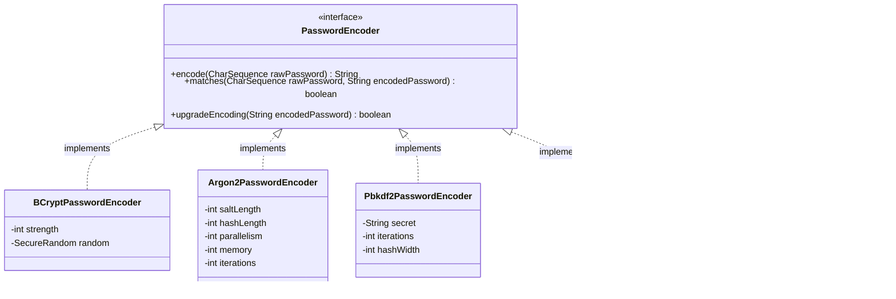

# Password Encoders: The Magic of Secure Authentication

## Recap: The Sorting Hat's Magic

In Chapter 1, we learned that the **Sorting Hat** uses magic to verify if a student really belongs at Hogwarts. It checks their "magic inside" against what the Registry Book says. This magic is the **PasswordEncoder**.

Now we dive deep into **the different types of magical verification**, from simple charms to the most powerful ancient spells. Just as wizards use different protective enchantments for different situations, Spring Security provides various password encoding strategies.

---

## Class Relationships Overview



---

## 1. The PasswordEncoder Contract: The Magic Interface

At its core, `PasswordEncoder` is a simple but powerful contract — like a spell that can both **cast a protective charm** (encode) and **verify if magic is authentic** (match).

### The Interface

```java
public interface PasswordEncoder {
    
    // Cast a protective charm on a password (one-way hashing)
    String encode(CharSequence rawPassword);
    
    // Verify if the spoken password matches the stored charm
    boolean matches(CharSequence rawPassword, String encodedPassword);
    
    // Check if the charm needs to be strengthened (optional)
    default boolean upgradeEncoding(String encodedPassword) {
        return false;
    }
}
```

### The Analogy: Magical Identity Verification at Hogwarts

| Method | Magical Equivalent | What It Does |
|--------|-------------------|--------------|
| `encode()` | Casting a Fidelius Charm | Takes a secret (password) and transforms it into something unrecognizable but verifiable |
| `matches()` | Prior Incantato | Checks if the magic used now matches the magic stored before |
| `upgradeEncoding()` | Checking Spell Strength | Determines if an old charm is too weak and needs recasting |

:::note Why One-Way?
Just as you can't reverse a Fidelius Charm to find out the secret, passwords are **one-way hashed**. Even Dumbledore cannot see the original password — he can only verify if what you say matches.
:::

---

## 2. Implementing Your Own Password Encoder: Crafting Custom Magic

Sometimes, the standard spells aren't enough. Perhaps you need a **proprietary magical authentication system** unique to your wizarding world.

### Example: The Hogwarts House-Specific Encoder

Imagine you want passwords to be encoded differently based on the wizard's house — Gryffindor uses lion magic, Slytherin uses snake magic, etc.

```java
@Component
public class HousePasswordEncoder implements PasswordEncoder {
    
    private final Map<String, String> houseSalts = Map.of(
        "Gryffindor", "LionHeart",
        "Slytherin", "SnakeEyes",
        "Ravenclaw", "EagleWisdom",
        "Hufflepuff", "BadgerLoyal"
    );
    
    @Override
    public String encode(CharSequence rawPassword) {
        // In reality, you'd determine house from user context
        String house = determineUserHouse(); 
        String salt = houseSalts.getOrDefault(house, "DefaultMagic");
        
        // Combine house salt with password and hash
        String combined = salt + rawPassword + salt;
        return hashWithSHA256(combined);
    }
    
    @Override
    public boolean matches(CharSequence rawPassword, String encodedPassword) {
        // Re-encode the provided password and compare
        String reEncoded = encode(rawPassword);
        return encodedPassword.equals(reEncoded);
    }
    
    private String hashWithSHA256(String input) {
        try {
            MessageDigest digest = MessageDigest.getInstance("SHA-256");
            byte[] hash = digest.digest(input.getBytes(StandardCharsets.UTF_8));
            return Base64.getEncoder().encodeToString(hash);
        } catch (NoSuchAlgorithmException e) {
            throw new RuntimeException("Magic failed!", e);
        }
    }
    
    private String determineUserHouse() {
        // Logic to determine user's house
        // Could use SecurityContext or passed parameter
        return "Gryffindor"; // Simplified
    }
}
```

### Registering Your Custom Encoder

```java
@Configuration
@EnableWebSecurity
public class SecurityConfig {
    
    @Autowired
    private HousePasswordEncoder housePasswordEncoder;
    
    @Bean
    public PasswordEncoder passwordEncoder() {
        return housePasswordEncoder;
    }
    
    @Bean
    public AuthenticationProvider authenticationProvider() {
        DaoAuthenticationProvider provider = new DaoAuthenticationProvider();
        provider.setUserDetailsService(userDetailsService());
        provider.setPasswordEncoder(housePasswordEncoder);
        return provider;
    }
}
```

:::warning When to Create Custom Encoders
Only create custom encoders when:
- You have **legacy systems** with proprietary hashing algorithms
- You need **house-specific** or **context-aware** encoding
- You're migrating from an **old system** with unique requirements

**Never** create weak encoders for "simplicity" — this is like using a simple Locking Charm when you need the Fidelius Charm!
:::

---

## 3. Types of Password Encoders: The Spellbook of Security

Spring Security provides several powerful encoders, each like a different tier of magical protection.

### Comparison Table: Magical Protection Levels

| Encoder | Magical Tier | Strength | Speed | Use Case |
|---------|---------------|----------|-------|----------|
| **BCrypt** | Standard School Spell | Strong | Moderate | **Default choice for most applications** |
| **Argon2** | Ancient Powerful Magic | Very Strong | Slow | High security, winner of Password Hashing Competition |
| **PBKDF2** | Ministry of Magic Standard | Strong | Moderate | FIPS compliance required |
| **SCrypt** | Advanced Protective Charm | Very Strong | Slow | Memory-hard, resists GPU attacks |
| **SHA-256** | Basic Charm | Weak | Fast | **Deprecated** — don't use for passwords! |

---

### 3.1 BCryptPasswordEncoder: The Standard Shield Charm

**BCrypt** is like the **Shield Charm (Protego)** — the standard, reliable protection every wizard learns.

```java
@Bean
public PasswordEncoder passwordEncoder() {
    // Strength factor 10 (default) = 2^10 = 1024 iterations
    // Higher = more secure but slower
    return new BCryptPasswordEncoder();
}

// With custom strength
@Bean
public PasswordEncoder strongPasswordEncoder() {
    // Strength 12 = 2^12 = 4096 iterations (4x slower, more secure)
    return new BCryptPasswordEncoder(12);
}

// With custom random generator
@Bean
public PasswordEncoder securePasswordEncoder() {
    return new BCryptPasswordEncoder(BCryptVersion.$2Y, 12, new SecureRandom());
}
```

**How it works:**
- Automatically generates a **salt** (random data) for each password
- Combines salt + password, then hashes multiple times (2^strength)
- Stores salt + hash together: `$2a$10$N9qo8uLOickgx2ZMRZoMy.MqrqhmM6JGKpS4G3R1G2JH8YpfB0Bqy`

**Why it's great:**
- ✅ Automatic salting prevents rainbow table attacks
- ✅ Adjustable strength factor
- ✅ Battle-tested for decades
- ✅ Built into Spring Security by default

---

### 3.2 Argon2PasswordEncoder: The Elder Wand of Hashing

**Argon2** is like wielding the **Elder Wand** — the most powerful protection available. Winner of the 2015 Password Hashing Competition.

```java
@Bean
public PasswordEncoder argon2PasswordEncoder() {
    return Argon2PasswordEncoder.defaultsForSpringSecurity_v5_8();
}

// Or with custom parameters
@Bean
public PasswordEncoder customArgon2Encoder() {
    return new Argon2PasswordEncoder(
        16,     // saltLength: 16 bytes
        32,     // hashLength: 32 bytes  
        1,      // parallelism: 1 thread
        65536,  // memory: 64 MB
        3       // iterations: 3 passes
    );
}
```

**Parameters explained:**
- **Salt length**: Random data size (larger = more unique)
- **Hash length**: Output size (larger = more collision-resistant)
- **Parallelism**: CPU threads used (higher = faster but more resource-intensive)
- **Memory**: Memory required (higher = more resistant to GPU attacks)
- **Iterations**: Number of hashing passes (higher = slower but more secure)

**Why it's the best:**
- ✅ Memory-hard (resists GPU/ASIC attacks)
- ✅ Winner of Password Hashing Competition
- ✅ Resistant to side-channel attacks
- ⚠️ Requires more memory and CPU

:::tip When to Use Argon2
Use Argon2 for **high-security applications** — banking, healthcare, or any system where password cracking would be catastrophic.
:::

---

### 3.3 Pbkdf2PasswordEncoder: The Ministry Standard

**PBKDF2** (Password-Based Key Derivation Function 2) is like a **Ministry of Magic certified spell** — required in many regulated environments.

```java
@Bean
public PasswordEncoder pbkdf2PasswordEncoder() {
    return Pbkdf2PasswordEncoder.defaultsForSpringSecurity_v5_8();
}

// With custom secret and parameters
@Bean
public PasswordEncoder customPbkdf2Encoder() {
    return new Pbkdf2PasswordEncoder(
        "hogwartsSecretSalt",  // Secret salt (keep this safe!)
        10000,                  // iterations: 10,000 rounds
        256                     // hashWidth: 256 bits
    );
}
```

**Why use it:**
- ✅ FIPS 140-2 compliant (required for US government/finance)
- ✅ Widely supported across platforms
- ✅ Adjustable iteration count

**Limitations:**
- ❌ Not memory-hard (vulnerable to GPU attacks)
- ❌ Slower than BCrypt for same security level

---

### 3.4 SCryptPasswordEncoder: The Memory-Resistant Enchantment

**SCrypt** is another **memory-hard** algorithm, like casting a spell that requires so much magical energy that dark wizards can't brute-force it.

```java
@Bean
public PasswordEncoder scryptPasswordEncoder() {
    return SCryptPasswordEncoder.defaultsForSpringSecurity_v5_8();
}

// Custom configuration
@Bean
public PasswordEncoder customScryptEncoder() {
    return new SCryptPasswordEncoder(
        16384,  // CPU cost (N): 2^14 iterations
        8,      // Memory cost (r): 8 * 128 = 1KB per block
        1,      // Parallelization (p): 1 thread
        32,     // keyLength: 32 bytes output
        16      // saltLength: 16 bytes
    );
}
```

**Why it's special:**
- ✅ Memory-hard like Argon2
- ✅ Configurable CPU and memory costs
- ✅ Good alternative to Argon2

---

## 4. DelegatingPasswordEncoder: The Versatile Spellcaster

Real-world applications often face a challenge: **How do you support multiple encoding schemes?** Perhaps you have:
- Old users with SHA-256 encoded passwords (legacy)
- New users with BCrypt encoded passwords (current)
- Admin users with Argon2 encoded passwords (high security)

The **DelegatingPasswordEncoder** is like having a **versatile spellcaster** who knows multiple spells and picks the right one for each situation.

### How It Works

Passwords are stored with a **prefix** indicating their encoding:
```
{bcrypt}$2a$10$N9qo8uLOickgx2ZMRZoMy...
{argon2}$argon2id$v=19$m=65536,t=3,p=4$...
{pbkdf2}5b7c5e8c9d1f2a3b4c5d6e7f8a9b0c1d...
{sha256}5e884898da28047151d0e56f8dc6292773603d0d6aabbdd62a11ef721d1542d8
```

### Creating a DelegatingPasswordEncoder

```java
@Bean
public PasswordEncoder passwordEncoder() {
    // Create encoders map
    Map<String, PasswordEncoder> encoders = new HashMap<>();
    
    // Current/recommended encoder
    encoders.put("bcrypt", new BCryptPasswordEncoder());
    encoders.put("argon2", Argon2PasswordEncoder.defaultsForSpringSecurity_v5_8());
    
    // Legacy support (for migration)
    encoders.put("pbkdf2", Pbkdf2PasswordEncoder.defaultsForSpringSecurity_v5_8());
    
    // Very old legacy (deprecated but supported for reading)
    encoders.put("sha256", new MessageDigestPasswordEncoder("SHA-256"));
    
    // Create delegating encoder with default for new passwords
    return new DelegatingPasswordEncoder("bcrypt", encoders);
}
```

### The Convenient Factory Method

Spring Security provides a pre-configured delegating encoder:

```java
@Bean
public PasswordEncoder passwordEncoder() {
    // Creates encoder supporting: bcrypt, ldap, MD4, MD5, 
    // noop, pbkdf2, scrypt, SHA-1, SHA-256, sha256, argon2
    return PasswordEncoderFactories.createDelegatingPasswordEncoder();
}
```

**Supported algorithms:**
- `bcrypt` - BCrypt (recommended default)
- `argon2` - Argon2 (high security)
- `pbkdf2` - PBKDF2 (FIPS compliant)
- `scrypt` - SCrypt (memory-hard)
- `sha256` - SHA-256 (legacy, deprecated)
- `noop` - No encoding (testing only!)

### Migration Strategy

```java
@Configuration
@EnableWebSecurity
public class SecurityConfig {
    
    @Bean
    public PasswordEncoder passwordEncoder() {
        return PasswordEncoderFactories.createDelegatingPasswordEncoder();
    }
    
    @Bean
    public AuthenticationProvider authenticationProvider(
            UserDetailsService userDetailsService,
            PasswordEncoder passwordEncoder) {
        
        DaoAuthenticationProvider provider = new DaoAuthenticationProvider();
        provider.setUserDetailsService(userDetailsService);
        provider.setPasswordEncoder(passwordEncoder);
        
        // Enable password upgrade on successful login
        provider.setUserDetailsPasswordService(userDetailsPasswordService());
        
        return provider;
    }
    
    @Bean
    public UserDetailsPasswordService userDetailsPasswordService() {
        return (user, newPassword) -> {
            // Update user's password with new encoding
            userRepository.updatePassword(user.getUsername(), newPassword);
        };
    }
}
```

**How migration works:**
1. User logs in with old `{sha256}...` password
2. System verifies using SHA-256
3. `UserDetailsPasswordService` automatically re-encodes with `{bcrypt}...`
4. Next login uses the stronger BCrypt encoding

:::tip Best Practice
Always use `DelegatingPasswordEncoder` in production. Even if you only use BCrypt now, this future-proofs your application for algorithm upgrades.
:::

---

## 5. Spring Security Crypto Module: Advanced Magical Arts

Beyond password encoding, Spring Security provides a complete **cryptographic toolkit** for:
- **Key generation** (creating magical keys)
- **Encryption/Decryption** (sealing and unsealing secrets)
- **Random number generation** (for salts and IVs)

### 5.1 Key Generators: Crafting Magical Keys

Key generators create the random data needed for encryption — like crafting unique wand cores for each spell.

```java
// Generate random bytes for encryption keys
BytesKeyGenerator secureKeyGenerator = KeyGenerators.secureRandom(32);
byte[] key = secureKeyGenerator.generateKey();
// Result: 32 random bytes (256 bits) suitable for AES-256

// Generate string-based keys (for simpler storage)
StringKeyGenerator stringKeyGenerator = KeyGenerators.string();
String hexKey = stringKeyGenerator.generateKey();
// Result: Hex-encoded random string (e.g., "a3f7c2d9e8b5...")

// Generate shared keys (for scenarios where sender and receiver need the same key)
BytesKeyGenerator sharedKeyGenerator = KeyGenerators.shared(16);
byte[] sharedKey = sharedKeyGenerator.generateKey();
// Returns the same key every time (for specific use cases)
```

**Use cases:**
- Creating AES encryption keys
- Generating salts for password hashing
- Creating initialization vectors (IVs) for cipher modes
- API key generation

---

### 5.2 Encryptors: The Unbreakable Charm

Encryptors seal your secrets so only authorized parties can read them — like placing something in a **Gringotts vault** protected by the most powerful enchantments.

Spring Security provides two types:

#### Text Encryptors: For String Data

```java
// Create an encryptor with a password and salt
TextEncryptor encryptor = Encryptors.text("hogwartsPassword", "5c0744940b5c369b");

// Encrypt sensitive data
String secretMessage = "The Chamber of Secrets has been opened!";
String encrypted = encryptor.encrypt(secretMessage);
// Result: Hex-encoded encrypted string

// Decrypt when needed
String decrypted = encryptor.decrypt(encrypted);
// Result: "The Chamber of Secrets has been opened!"
```

#### Bytes Encryptors: For Binary Data

```java
// Create bytes encryptor
BytesEncryptor bytesEncryptor = Encryptors.standard("mySecretPassword", "16ByteSaltValue");

// Encrypt binary data
byte[] sensitiveData = Files.readAllBytes(Path.of("secret.pdf"));
byte[] encryptedData = bytesEncryptor.encrypt(sensitiveData);

// Decrypt binary data
byte[] decryptedData = bytesEncryptor.decrypt(encryptedData);
Files.write(Path.of("secret_restored.pdf"), decryptedData);
```

---

### 5.3 Stronger Encryption: AES-256 with GCM

For maximum security, use **AES-256 with GCM mode** — the magical equivalent of the **Fidelius Charm**:

```java
// Create a strong encryptor (AES-256-GCM)
BytesEncryptor strongEncryptor = Encryptors.stronger("masterPassword", "randomSaltValue16B");

// This uses:
// - AES-256 encryption
// - GCM mode (authenticated encryption)
// - 256-bit key from PBKDF2
// - Random IV for each encryption

String secret = "Snape is protecting Harry!";
String encrypted = new String(strongEncryptor.encrypt(secret.getBytes()));
```

**Why AES-256-GCM:**
- ✅ **Confidentiality**: Data cannot be read without the key
- ✅ **Authentication**: Detects if data was tampered with
- ✅ **256-bit keys**: Resistant to brute force attacks
- ✅ **GCM mode**: Efficient authenticated encryption

---

### 5.4 Queryable Text: Encrypting Searchable Data

Sometimes you need to encrypt data but still **search for it** — like having a magical index of sealed documents.

```java
// Creates consistent encryption (same input = same output)
TextEncryptor queryableEncryptor = Encryptors.queryableText("password", "salt");

// Encrypt user email
String email = "harry.potter@hogwarts.edu";
String encryptedEmail = queryableEncryptor.encrypt(email);

// Later, search for the same email
String searchEmail = queryableEncryptor.encrypt("harry.potter@hogwarts.edu");
// encryptedEmail.equals(searchEmail) == true

// You can now query the database:
// SELECT * FROM users WHERE encrypted_email = ?
```

:::warning Security Trade-off
Queryable encryption is **less secure** because it doesn't use random IVs. Only use it for fields you absolutely must search by, and combine with other security measures.
:::

---

### 5.5 Delux Encryption: All-in-One Solution

The `Delux` variants provide everything in one package:

```java
// Deluxe text encryptor with strong defaults
TextEncryptor deluxText = Encryptors.delux("strongPassword", "16ByteSalt1234");

// Deluxe bytes encryptor
BytesEncryptor deluxBytes = Encryptors.delux("strongPassword", "16ByteSalt1234");
```

---

## 6. Complete Example: Hogwarts Secret Vault

Let's put it all together in a real-world example — a secure vault for storing magical secrets.

```java
@Service
public class HogwartsSecretVault {
    
    private final TextEncryptor textEncryptor;
    private final BytesEncryptor bytesEncryptor;
    private final PasswordEncoder passwordEncoder;
    
    public HogwartsSecretVault(
            @Value("${vault.password}") String vaultPassword,
            @Value("${vault.salt}") String vaultSalt) {
        
        // Create encryptors with configuration
        this.textEncryptor = Encryptors.delux(vaultPassword, vaultSalt);
        this.bytesEncryptor = Encryptors.stronger(vaultPassword, vaultSalt);
        
        // Use DelegatingPasswordEncoder for user passwords
        this.passwordEncoder = PasswordEncoderFactories.createDelegatingPasswordEncoder();
    }
    
    // Store a new wizard with secure password
    public void enrollWizard(String username, String rawPassword, String house) {
        String encodedPassword = passwordEncoder.encode(rawPassword);
        
        // Store in database with prefix indicating algorithm
        // e.g., {bcrypt}$2a$10$...
        wizardRepository.save(new Wizard(username, encodedPassword, house));
    }
    
    // Verify wizard credentials
    public boolean verifyWizard(String username, String rawPassword) {
        Wizard wizard = wizardRepository.findByUsername(username)
            .orElseThrow(() -> new UsernameNotFoundException("Wizard not found"));
        
        return passwordEncoder.matches(rawPassword, wizard.getPassword());
    }
    
    // Store a magical secret (encrypted)
    public void storeSecret(String secretName, String secretContent) {
        String encrypted = textEncryptor.encrypt(secretContent);
        secretRepository.save(new Secret(secretName, encrypted));
    }
    
    // Retrieve and decrypt a secret
    public String retrieveSecret(String secretName) {
        Secret secret = secretRepository.findByName(secretName)
            .orElseThrow(() -> new SecretNotFoundException("Secret not found"));
        
        return textEncryptor.decrypt(secret.getEncryptedContent());
    }
    
    // Encrypt sensitive document
    public byte[] encryptDocument(byte[] document) {
        return bytesEncryptor.encrypt(document);
    }
    
    // Decrypt sensitive document
    public byte[] decryptDocument(byte[] encryptedDocument) {
        return bytesEncryptor.decrypt(encryptedDocument);
    }
    
    // Generate a secure API key for a wizard
    public String generateApiKey() {
        return KeyGenerators.string().generateKey();
    }
}
```

---

## 7. Security Best Practices: The Defense Against the Dark Arts

### The Seven Sacred Principles of Password Security

```
1. NEVER store passwords in plain text
   → Always encode with one-way hash

2. ALWAYS use a salt
   → Prevents rainbow table attacks

3. USE adaptive/iterative hashing
   → BCrypt, Argon2, PBKDF2, SCrypt

4. CHOOSE appropriate strength
   → Balance security vs performance

5. USE DelegatingPasswordEncoder
   → Future-proof for algorithm changes

6. UPGRADE weak passwords
   → Re-encode on successful login

7. PROTECT encryption keys
   → Store keys separately from data
```

### Configuration Examples for Different Security Levels

**Standard Application (BCrypt default):**
```java
@Bean
public PasswordEncoder passwordEncoder() {
    return new BCryptPasswordEncoder();
}
```

**High Security Application (Argon2):**
```java
@Bean
public PasswordEncoder passwordEncoder() {
    return Argon2PasswordEncoder.defaultsForSpringSecurity_v5_8();
}
```

**Enterprise Application (FIPS compliant):**
```java
@Bean
public PasswordEncoder passwordEncoder() {
    return Pbkdf2PasswordEncoder.defaultsForSpringSecurity_v5_8();
}
```

**Legacy Migration (Delegating):**
```java
@Bean
public PasswordEncoder passwordEncoder() {
    return PasswordEncoderFactories.createDelegatingPasswordEncoder();
}
```

---

## Chapter Summary

| Component | Magical Equivalent | What You Learned |
|-----------|-------------------|------------------|
| `PasswordEncoder` | Magical Identity Verification | Interface for encoding and verifying passwords |
| `BCryptPasswordEncoder` | Shield Charm (Protego) | Standard protection with automatic salting |
| `Argon2PasswordEncoder` | Elder Wand | Most powerful, memory-hard protection |
| `PBKDF2PasswordEncoder` | Ministry Standard | FIPS-compliant, government-approved |
| `SCryptPasswordEncoder` | Memory-Resistant Enchantment | GPU-resistant adaptive hashing |
| `DelegatingPasswordEncoder` | Versatile Spellcaster | Supports multiple algorithms simultaneously |
| `KeyGenerators` | Wand Core Crafter | Generates random keys and salts |
| `TextEncryptor` | Sealing Charm | Encrypts and decrypts text data |
| `BytesEncryptor` | Vault Enchantment | Encrypts and decrypts binary data |

---

## Quick Reference: Which Encoder Should I Use?

```
Starting a new project?
    → BCryptPasswordEncoder (simple) 
    → OR Argon2PasswordEncoder (maximum security)

Have legacy passwords to support?
    → DelegatingPasswordEncoder with multiple algorithms

Need FIPS compliance?
    → Pbkdf2PasswordEncoder

Protecting against GPU attacks?
    → Argon2PasswordEncoder or SCryptPasswordEncoder

Encrypting sensitive data?
    → Encryptors.stronger() for AES-256-GCM

Need searchable encrypted data?
    → Encryptors.queryableText() (with caution!)
```

---

**Next Chapter:** We'll explore the AuthenticationProvider in depth — understanding how the Sorting Hat (DaoAuthenticationProvider) orchestrates the entire authentication ceremony! 🎩✨
